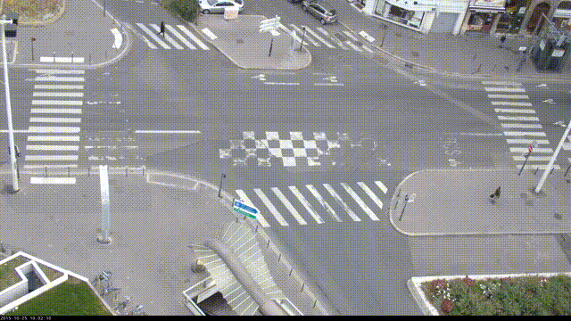
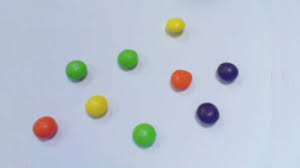

# Sujet Evaluation Python/OpenCV UV RobVis 2023-2024

Ce sujet d'1h30 comporte deux volets.
Dans le premier volet, il s'agit de détecter et de compter les petis dragibus par couleur.

Dans le second volet (Etape 1 à 3), il s'agit de développer le script python capable de détecter les **objets présents** 
dans une séquence d'images prise à partir la caméra de surveillance d'un carrefour et de les classer en 3 classes (voiture/piéton/moto).

Pour cela, vous vous appuierez très majoritairement sur les codes que vous avez testés durant les séances de TP précédentes et tout particulièrement
ce qui vous a été montré en matière de segmentation et de détection d'objets.

Vous ferez tous vos tests du volet 2 sur la vidéo que je vous ai fournie (***carrrefour640x360.mp4***) et qui est dans le zip téléchargeable :


Attention c'est un travail individuel. Il est question d'évaluer ce que chacun d'entre vous a retenu de cette partie de l'UV.
Veillez bien à répondre à chaque étape afin que je puisse vous évaluer de manière progressive et respectez bien le nom des fichiers .py
que je vous demande de produire. **Vous nous remettrez tous les scripts .py dans un fichier compressé qui prenom.nom.zip quevous enverrez à amel.aissaoui@imt-nord-europe.fr et sebastien.ambellouis@imt-nord-europe.fr**.

## Volet 1 : Détection des dragibus

Voici l'image que vous traiterez :



Sur cette image, vous observez un nombre de bonbons de différentes couleur. Je vous propose de produire deux scripts :
1) volet1_script1.py : vous permettra de détecter tous les bonbons et de déterminer et afficher leur nombre.
2) volet1_script2.py : vous permettra de déterminer le nombre de bonbons par couleur.

*IMPORTANT* : je ne vous demande pas de déterminer de manière automatique les classes de couleur
 

## Volet 2

### Etape 1

Afin de détecter les objets présents dans une image *t* de la séquence, un moyen simple est de faire la différence entre cette image *t*  et une image du "fond" vide i.e. acquise lorsqu'aucun objet n'est présent. Dans le cadre de ce carrefour, l'image de fond (***bg640x360.png***) est l'image du carrefour sans aucun mobile le traversant. Pour faire une différence entre deux images vous utilserez la fonction ```cv.absdiff(im1,im2)``` qui calcule la valeur absolue de la différence de deux images : *diff* pour faire la différence et *abs* pour en faire la valeur absolue et éviter les valeur négative. Par conséquent, il est assez facile d'imaginer qu'elle sera le résultat d'une telle différence entre l'image d'une scène vide et l'image de la même scène avec des objets.

Dans cette première étape je vous demande donc de produire le script python *volet2_script1.py* qui réalise les actions suivantes :

- le chargement de l'image de fond ;
- l'ouverture et la lecture de chaque image de la vidéo ;
- la différence entre l'image de fond et chaque image de la vidéo ;
- l'affichage (dans deux fenêtres différentes) de l'image de la vidéo et de l'image différence.

Contrairement au volet 1, vous opèrerez sur des images en niveau de gris donc il faudra veiller à convertir les images.

### Etape 2

Dans l'étape 1, vous avez réalisé la détection des objets présents dans la scène. Dans cette deuxième étape, je vous demande d'écrire le script *volet2_script2.py* qui permet :
- de procéder (par binarisation) à la création du masque de chaque objet ;
- de nettoyer (supprimer les petites régions, le bruit etc.) ce masque avec des opérateurs morpholgiques (filtre médian, dilatation, fermeture etc.). Veillez à bien remplir toutes les formes ainsi détectées  ;
- de segmenter ce masque en plusieurs régions de pixels connexes ; 
- d'afficher tous les contours de ces régions en vert sur l'image.

## Etape 3

Je vous demande de modifier la partie du code de l'étape 2 afin de produire le script *volet2_script3.py* capable :
- d'appliquer le masque à l'image et d'afficher le résultat (vous devriez avoir en sortie une image dans laquelle seuls les objets sont présents et le reste des pixels sont noirs) ;
- de classer chaque région de pixels connexes dans l'une des trois classes qui nous intéressenn. Pour cela vous pourrez extraire des caractéristiques de forme sur les ensembles connexes trouvés précédemment. Vous pourrez, si nécessaire, choisir une ou plusieurs caractéristiques qui permettrons de mieux les différencier ;
- de dessiner et visualiser le contour des véhicules motorisés en rouge, les piétons en vert et les moto en bleu sur chaque image de la vidéo ;
- de compter dans chaque image et en les différenciant les véhicules motorisés, piétons et motos. Vous afficherez ces deux compteurs en haut à gauche de l'image de la vidéo.


**BON COURAGE A VOUS ET BONNE CONTINUATION !**
